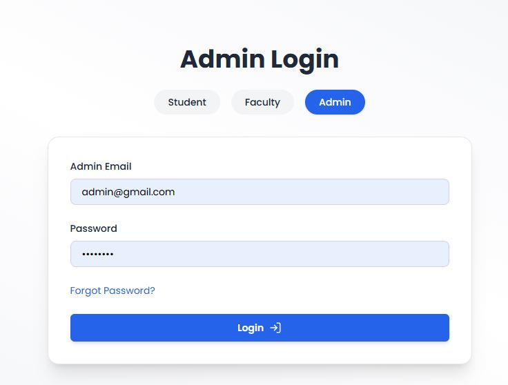
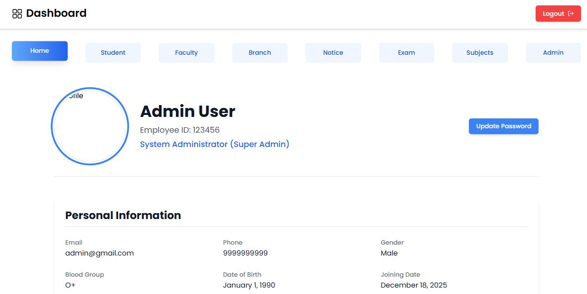
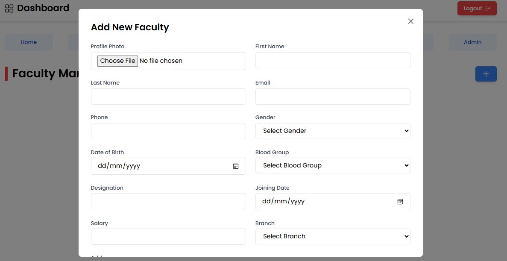
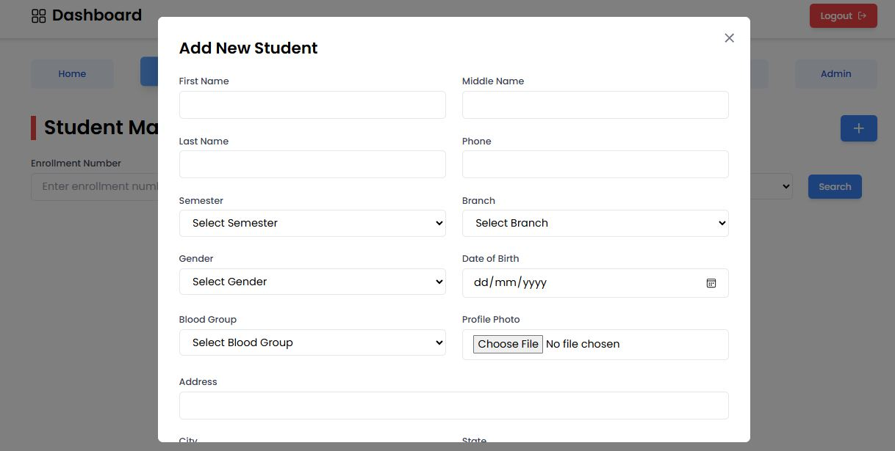

#  College Management System 

A full-stack **College Management System** built using the **MERN stack**, designed to streamline academic and administrative operations such as faculty management, student management, notices, subjects, exams, materials, timetables, and marks.  
The system supports **role-based authentication** for **Admin, Faculty, and Students** with secure APIs and production-ready deployment.

---

## Live Demo
   https://college-management-system-peach.vercel.app/

---

## Features

### Authentication & Authorization
- JWT-based authentication
- Role-based access control (Admin / Faculty / Student)
- Secure password hashing using **bcrypt**
- Protected routes using middleware

###  Faculty Management
- Add, update, delete faculty
- Profile image upload using Multer
- Auto-generated employee ID
- Default password assignment with secure hashing

### Student Management
- Student registration and login
- Secure profile management
- Role-restricted access

###  Notice Management
- Create, update, delete notices
- Auth-protected notice APIs
- Centralized notice system for all users

### Academic Modules
- Branch management
- Subject management
- Timetable management
- Study material upload
- Exam and marks management

###  File Uploads
- Image and file uploads using **Multer**
- Automatic media directory creation (Render-safe)
- Static file serving via Express

---

## Tech Stack

### Frontend
- React.js
- Axios
- React Router
- Tailwind CSS
- React Icons
- React Hot Toast

### Backend
- Node.js
- Express.js
- MongoDB & Mongoose
- JWT (jsonwebtoken)
- Multer (file uploads)
- bcryptjs (password hashing)
- CORS

### Deployment
- Backend: **Render**
- Database: **MongoDB Atlas**

---

## Local Deployment (Run Project on Your System)
Follow the steps below to run the MGNREGA Analytics Dashboard locally.

## Prerequisites
Make sure you have the following installed:

Node.js 
MongoDB (Local MongoDB OR MongoDB Compass)
Git
npm

## Clone the Repository
Backend Setup (Node.js + Express + MongoDB)
Navigate to backend folder: cd backend

Install backend dependencies: npm install

---Your data is now available for the backend---

Start Backend Server: nodemon server.js

If successful, you will see: MongoDB connected Server running on port 5000

Navigate to frontend folder: cd frontend

Install frontend dependencies: npm install

Start Frontend Server: npm start

## Project Screenshots

 Login Page

 Admin Dashboard

 Faculty Management

 Student Management

 Branch details

## Author:

Sahil Kumar
Full Stack Developer

